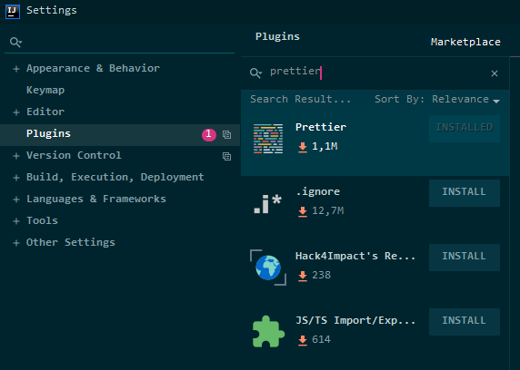
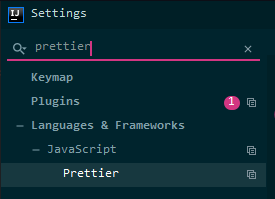
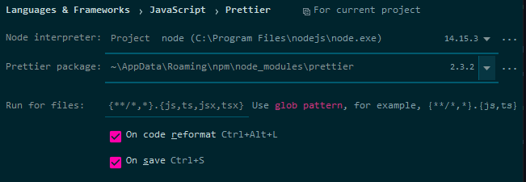

# Skill Up
## Devjobs

A project made by group of Friends to increase their value on labor market.

### Team - "Runtime Terror"

- **Piotr Patalas**
- **Kamil Kałuża**
- **Jakub Radzik**
- **Adrian Konopnicki**

### Technologies

- Backend: Java 17, Spring Boot
- Frontend:
- Mobile:

# USEFUL

## Editing Database Schema:

1. Go to: <a href="https://app.diagrams.net/">DRAW.IO</a>
2. Authorize with your Github Account
3. Open Existing Diagram
4. Authorize
5. Click on: "Enter Value..."
6. Paste: "Future-Developers-Lab/Skill-Up"
7. master -> schema -> db.drawio
8. Done

## Run Development Environment

## Prettier

For style unification we use prettier - opinionated code formatter with support for:
JavaScript, JSX, Angular, TypeScript etc.

To configure properly you should (steps for IntelliJ IDEA Ultimate):

1. *Ctrl + Alt + S*
2. Go to: *Plugin Section > Marketplace*

   
3. Install it and click *Apply*
4. Now in settings search write: *prettier*
5. Select *Languages & Framework > JavaScript > "Prettier*

   
6. Now configure prettier. Notice that you have to select prettier package.
For this purpose (if you use windows) you can find it by running "Windows + R"
and run "%appdata%". Next go to *npm > node_modules > prettier* and copy path.
My looks like that: "C:\Users\jakub\AppData\Roaming\npm\node_modules\prettier"
Paste it to IntelliJ. Correct configuration:
   

7. In project files find *.prettierrc* file. After open you should see information:
Do you want to use prettier config for this project, select yes and that's it.

8. Format code is on *Ctrl + Alt + L*